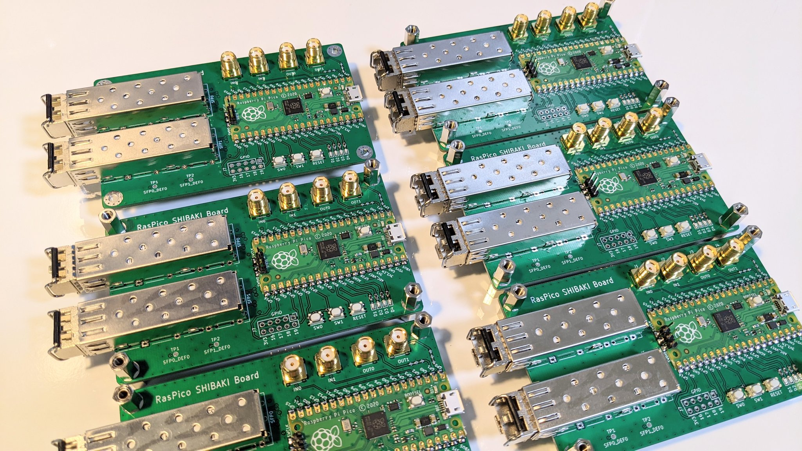

# RasPico_SHIBAKI_Board
Raspberry Pi Pico で色々やる基板です。  

### 搭載インタフェース
| インタフェース | 説明 |
| ---- | ---- |
| SFP | 2スロット搭載。TXRX、LOS、TX_FAULT、I2C の基本的な信号線が Pico と接続されています。RATE_SELECT、TX_DISABLE ははんだジャンパで指定します。 |
| GPIO | 2.54mm pitch 2x5ピンヘッダを搭載。4pin + 3.3V + GND が出ています。機能拡張等に使用できます。 |
| LED | 4個搭載（Pico ボードに標準搭載のLEDを含めると合計5個）。Lチカデバッグや UART、S/PDIF 信号を出力して遊べます。 |
| Push SW | User 用2個（プルアップ抵抗付き）、Reset 用1個搭載 |
| SMA Input | 2個搭載。50Ω終端抵抗（標準では未実装）を実装するパッドを用意しています。 |
| SMA Output | 2個搭載。標準で 450Ω の抵抗が直列に挿入されています。50Ω 終端可能なオシロスコープに接続するとx10減衰として機能します。レベルを変更したい場合は適宜抵抗を打ち替えてください。 |

### 基板画像
  
  
  
  

## サンプルソフトウェア
本ボードで遊べるサンプルプログラムです。  
100BASE-FX による UDP 送信例、VBAN プロトコルによる PCM データ送信、SFP モジュール情報読み出し、8b10b エンコード・デコード（PIO を使った SerDes with Clockrecovery）等を追々追加していく予定です。  
| Link | 説明 |
| ---- | ---- |
| [hwtest](firmware/hwtest/ "hwtest") | ハードウェアテスト用。<br> リセット直後にUSBシリアルから各ピンの電圧レベルやSFPモジュールのI2C読み出しデータ（Addr 0x50）等が出力されます。SW0押下でSFP0ポートからUDPパケットを100BASE-FXでブロードキャストします。SFP1の送受信は実装中... |
| [vban](firmware/vban/ "vban") | RasPico ADC + VBAN Protocol サンプル。<br> GP26(ADC0), GP27(ADC1) からオーディオ信号を入力すると、方チャンネル44.1kHzでサンプリングされてVBANプロトコルに載せてストリーミング送信します。ネットワーク設定はudp.hを適宜書き換えてください。 |
| [pattern_gen](firmware/pattern_gen/ "pattern_gen") | PIOを活用したパターンジェネレータサンプル。<br> SFP0とSMAOUT0端子から125MS/sで位相同期した任意のパターンを出力します。<br> SFPモジュールの伝搬遅延の評価等に使えます。サンプリングクロック周波数や出力端子も任意に設定可能です。 |


## 回路図
[Schematic.pdf](doc/schematic.pdf "Schematic")

## 既知のバグ
[doc/Rev1.0_Jumper.png](doc/Rev1.0_Jumper.png "Rev1.0_Jumper.png") 参照
* SFP0_SCLとSFP0_SDAのピンアサインを入れ替える必要あり
* SFP1_SCLがI2C1_SCLに、SFP1_SDAがI2C0_SDAに割りあたっており、配線修正必要

## 開発環境
- KiCad Version 6.0.5
- Raspberry Pi Pico 3D model and Footprint : [KiCad-RP-Pico](https://github.com/ncarandini/KiCad-RP-Pico "KiCad-RP-Pico")

## pico-sdk install memo
```
sudo apt install cmake gcc-arm-none-eabi libnewlib-arm-none-eabi libstdc++-arm-none-eabi-newlib build-essential
git clone https://github.com/raspberrypi/pico-sdk
cd pico-sdk
git submodule update --init
```
